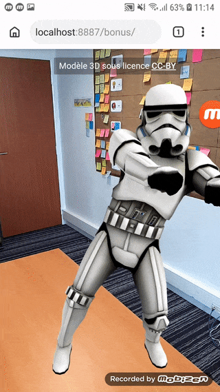

# Développez une application de réalité augmentée 100% Web

> ### 🚨 Peut ne pas fonctionner dans les dernières versions de Chrome Dev et Canary 🚨
>
> L’API WebXR est en cours de développement et soumise régulièrement à des changements. Ce codelab a été testé avec la version 78 de Chrome Dev.

Ce codelab est une traduction et légère adaptation du codelab [ar-with-webxr](https://github.com/googlecodelabs/ar-with-webxr) réalisé par [Jordan Santell](https://github.com/jsantell).

Ce dépôt contient la base de code pour le codelab [Développez une application de réalité augmentée 100% Web](https://vogloblinsky.github.io/webxr-codelab/).

Ce codelab est en évolution permanente. Si vous trouvez un bogue ou vous avez une suggestion, veuillez s'il vous plaît [soumettre un rapport de bogue](https://github.com/vogloblinsky/webxr-codelab/issues?q=is%3Aissue+is%3Aopen+sort%3Aupdated-desc). Merci !

Vous pouvez découvrir le [projet final ici](https://vogloblinsky.github.io/webxr-codelab/final).

## Ce que vous allez réaliser

## Ce que vous allez apprendre

-   Comment utiliser l’API WebXR
-   Comment trouver une surface en utilisant les tests de collisions de la réalité augmentée
-   Comment charger et afficher un modèle 3D synchronisé avec le flux vidéo de l’appareil photo

## Ce dont vous avez besoin

-   un PC de développement et un serveur local d’hébergement type Apache, nginx ou http-server (au travers de Node.js/npm)
-   un téléphone [compatible ARCore](https://developers.google.com/ar/discover/#supported_devices) tournant sous [Android 8.0 Oreo](https://www.android.com/versions/oreo-8-0/)
-   ARcore installé sur le téléphone (Chrome vous proposera de l’installer)
-   [Chrome Dev](https://www.google.com/chrome/dev). Utilisez une version >= 74, et utilisez la version “Dev build” (les branchements ARCore ne sont pas encore livrés sur les versions beta/prod)
-   [Web Server for Chrome](https://chrome.google.com/webstore/detail/web-server-for-chrome/ofhbbkphhbklhfoeikjpcbhemlocgigb), ou votre propre serveur web
-   un câble USB reliant votre téléphone à votre PC
-   l’exemple de code du codelab - Téléchargez le [zip](https://github.com/vogloblinsky/webxr-codelab/archive/master.zip) ou clonez ce dépôt
-   un éditeur de code
-   des connaissances en HTML, CSS, JavaScript et Chrome Devtools
